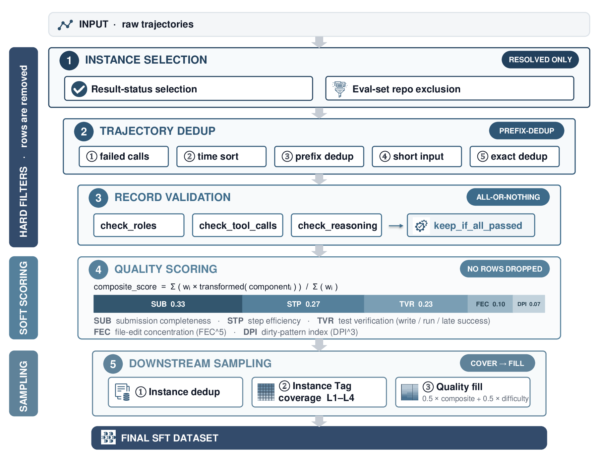

# 数据筛选与过滤策略总结

本文档总结 `swe_data_process` 仓库将原始 SWE轨迹转换为 SFT 训练数据（LF 格式）过程中所应用的**全部筛选、过滤与打分策略**，并配有端到端漏斗图。

> 适用脚手架：Claude Code (cc)、OpenCode (oc)、OpenHands SDK、Terminus2。下文以 CC/OC 转换器（`convert_cc_to_im.py`）为主线，其它脚手架流程结构一致，仅在原始格式解析与去重细节上不同。

---

## 一、筛选漏斗

漏斗按三条**泳道**组织：**硬过滤层**（①②③，删除数据） → **软打分层**（④，只打分不删除） → **下游采样层**（⑤，去重 + instance tag 独立覆盖 + 质量补齐）。数据量自上而下逐层收窄。



下面是同一漏斗的纯文本版本，便于在终端/diff 中查阅。

> 图例：`│ ▼` 主链路（保留并流入下一层）；`──►✗` 该步被丢弃的数据；`‹ … ? ›` 判定门（分支）；`┌─┐` 阶段产物（数据量里程碑）。

```text
                ┌──────────────────────────────────────────────────┐
                │  输入 · 原始轨迹                                   │
                │  全部 instance × 每个 instance 的所有轨迹快照      │
                └──────────────────────────────────────────────────┘
                                       │
══ 硬过滤层 ═══ 删除数据，数据量逐层收窄 ══════════════════════════════════════

   ① 实例级筛选 ──────────────────┐
      • 仅 resolved (reward=1.0)  ├──►✗  丢弃失败/泄漏实例
      • 排除评测集 repo (防泄漏)   ┘      （非 resolved · 命中评测集 repo）
                                       │
                ┌──────────────────────▼───────────────────────────┐
                │  通过状态 + repo 过滤的 instance                   │
                └──────────────────────────────────────────────────┘
                                       │
   ② 轨迹级去重 (仅CC/OC) ──────────┐
      • success=false 失败调用     ├──►✗  丢弃失败/冗余/短轨迹
      • 前缀冗余 / 整条精确重复     │      （input ≤ 2 短轨迹）
      • 短输入 (input ≤ 2)         ┘
                                       │
                ┌──────────────────────▼───────────────────────────┐
                │  去重后的轨迹记录                                  │
                └──────────────────────────────────────────────────┘
                                       │
   ③ 消息级校验 ────────────────────┐  check_roles · check_tool_calls
                                    │  · check_reasoning_content
                                    ▼
                    ‹ 实例内任一记录被过滤? ›───是──►✗  整实例丢弃
                                    │                 （「全或无」instance gate）
                                    │ 否
                ┌───────────────────▼──────────────────────────────┐
                │  有效 IM 记录（_instance_id / _agent_type 标签）   │
                └──────────────────────────────────────────────────┘
                                       │
══ 软打分层 ═══ 不删除，仅附 _score ═══════════════════════════════════════════

   ④ 质量打分 (TQS V2)
      • subagent → _score = null
      • main → composite_score ∈ [0,1]
                                       │
                ┌──────────────────────▼───────────────────────────┐
                │  IM / LF 训练数据 (.jsonl/.json) · 带 TQS V2 _score│
                └──────────────────────────────────────────────────┘
                                       │
══ 下游采样层 ═══ 去重 + instance tag 独立覆盖 + 质量补齐 ═══════════════════════

   instance 去重（同 id 保留质量分更高者）──►✗  重复轨迹行
                                       │
   instance tag 第 1–4 层独立覆盖（贪心最大化未覆盖取值）
                                       │
   剩余名额按质量分补齐（0.5×综合分 + 0.5×难度分）
                ┌──────────────────────▼───────────────────────────┐
                │  最终 SFT 数据集                                   │
                └──────────────────────────────────────────────────┘
```

---

## 二、四个阶段详解

### ① 实例级筛选 (Instance Selection)

入口 `convert_cc_to_im.py::main()`，决定**哪些 instance 进入处理**。

| 步骤 | 函数 | 策略 |
|------|------|------|
| 结果状态选择 | `get_instances_from_job_dir(job_dir, instance_status)` | 读 `job_dir/result.json` 的 `stats.evals[*].reward_stats.reward`，按 reward 值挑选：`resolved` → 仅 `1.0`，`unresolved` → 仅 `0.0`，`all` → 全部。CLI `--instance-status`，**默认 `resolved`**（只用通过测试的成功轨迹）。 |
| 参考库排除 | `load_exclusion_patterns()` + `filter_instance_ids_by_repo()` | 为避免训练数据与评测集在 repo 维度交叉，默认排除 `SWE-bench_Verified / SWE-bench_Pro / SWE-bench_Multilingual` 三个评测集涉及的 repo。排除清单随仓库提交在 `artifacts/excluded_repos.txt`（64 个 `owner/repo`），通过正则 `^owner__repo-\d+(__\w+)?$`（大小写不敏感）匹配 instance_id。CLI `--exclude-repos-file`，传 `""` 可禁用。 |

> instance_id 以 `extract_instance_id_from_config()` 从每个实例的 `config.json`（`task.path` 的目录名）读取，作为权威 id。

### ② 轨迹级去重 (Per-instance Dedup，仅 CC/OC)

入口 `extract_and_deduplicate_jsonl.py::deduplicate_trajectories()`，对单个 instance 的 `litellm-trajectory.jsonl` 做子轨迹去重，语义对齐 mini-vela：

1. **失败调用过滤** `filter_failed_records()`：丢弃 logger 标记 `success=false`（HTTP 超时 / 5xx / 上游拒答）的行，防止错误响应污染前缀去重。
2. **时间排序**：按 `request_time` 升序（缺失视为 0，稳定序）。
3. **前缀去重**：对 input 做规范化序列化后，若 `normalized[j]` 以 `normalized[i]` 为前缀，则较短的 `i` 被最长扩展 `j` 覆盖丢弃——同一轨迹的中间快照只保留最完整的一条。
4. **短输入过滤** `filter_short_input_records()`：input 条目数 `<= 2` 丢弃（无实质对话）。
5. **整条精确去重** `deduplicate_exact_records()`：剥离 `cache_control / signature / generation` 等字段后做整记录级去重，保持原顺序。

### ③ 消息级校验 (Record Validation)

`process_one_instance()` 内对每条转成 IM 的记录做三道校验，任一不过即丢弃该记录并计数：

| 校验 | 函数 | 规则 |
|------|------|------|
| 角色顺序 | `check_roles()` | 首条（去 system 后）必须是 `user`，末条必须是 `assistant`；`assistant` 后只能接 `tool`/`user`；`tool` 后只能接 `tool`/`assistant`；`user` 后只能接 `assistant`。 |
| 工具调用完整性 | `check_tool_calls()` | 除最后一轮外，其余 `assistant` 轮次必须都带 `tool_calls`。 |
| 思维链完整性 | `check_reasoning_content()` | 非 `fast` 模式下，`pseudo_turns` 之后的所有 `assistant` 轮次必须有非空 `reasoning_content`。 |

**实例捆绑判定** `should_keep_instance()`：**只有当该实例 `role_filtered == 0` 且 `reasoning_filtered == 0`（即无任何记录被过滤）时，才保留该实例的全部记录**；否则整实例丢弃。这是一个严格的「全或无」策略，保证训练数据的实例完整性。

保留后用 `tag_instance_records()` 打上 `_instance_id` 和 `_agent_type`（依据是否拥有 `edit/write` 写工具区分 `main` / `subagent`）。

### ④ 质量打分 (Auto Scoring，TQS V2)

`score_dataset()` 在 IM 生成后自动调用（无硬过滤，只附 `_score`）：

- `subagent` 记录不打分，`_score = null`（仍保留在输出中）。
- `main` 记录计算 TQS V2 综合分：

```text
composite_score = Σ(weight_i × transformed(component_i)) / Σ(weight_i)
```

| 组件 | 权重 | 含义 |
|------|------|------|
| `SUB` 提交完整性 | 0.33 | 轨迹是否正常收尾 + 后期错误率/测试调整 |
| `STP` 步数效率 | 0.27 | assistant 轮数是否落在合理区间（5–30 满分，≥90 为零） |
| `TVR` 测试验证 | 0.23 | 是否写测试 / 跑测试 / 末次测试是否成功 |
| `FEC` 编辑集中度 | 0.10 | 编辑是否过度集中于少量文件（聚合用 `FEC^5`） |
| `DPI` 脏模式惩罚 | 0.07 | 截断/无成功写/长循环/重复错误（聚合用 `DPI^3`） |
| `OEC/IAC/PED/PSN/TTE/SCP` | 0.00 | 仅诊断输出，不参与综合分 |

> 详见 [`rule_score_details.md`](rule_score_details.md)。打分本身不做删除——分数仅作为后续筛选依据。

---

## 三、下游数据筛选（instance tag 独立覆盖 + 质量补齐）

轨迹经 ④ 打分（得到综合分等 TQS V2 指标）后，训练子集的最终选取采用 **多样性优先、质量补齐** 策略：先按 instance 去重，再对 **instance tag**（实例元数据里的分层标签，如领域/语言等，不是轨迹消息上的标签）第 1–4 层做独立取值覆盖，剩余名额按质量分填满。打分与采样串成闭环：综合分进入质量分，难度档位同步加权。

### 1. 质量分

```text
selection_score = 0.5 × composite_score + 0.5 × difficulty_score
```

| 难度档位 | difficulty_score |
|----------|------------------|
| easy | 0.0 |
| medium | 0.5 |
| hard | 1.0 |

同一 `instance_id` 多行时，保留质量分更高者（同分取更早出现的行）。

### 2. instance tag 第 1–4 层独立覆盖

每条样本对应一个 instance，其元数据带 3 或 4 层 **instance tag**（不足 4 层用占位符补齐）。覆盖阶段把每一层视为**独立**的多样性维度（不假设层与层之间是父子路径）：

- 目标：源池中第 1、2、3、4 层各自出现过的每一个 instance tag 取值，在子集中都至少出现一次。
- 贪心选取：每轮优先选「当前能覆盖最多尚未见到的取值」的样本；并列时取质量分更高、再按稳定键打破平局。
- 若完整覆盖会超出保留名额，则在预算内尽可能多地覆盖取值，再进入补齐阶段。

### 3. 质量补齐

覆盖核心选完后，剩余名额按质量分从高到低补齐，直到达到目标保留量（默认约源池 80%，也可指定精确条数）。配对的 IM / LF 行按同一源行下标对齐写出。

### 其它可选信号

- **按分数捆绑过滤**：以 instance 为单位，若 main agent 最高综合分达到阈值则保留整个实例，否则整实例丢弃（更简单的阈值式替代方案）。
- **LLM 打分**：LLM-as-judge 或多维检查表结果可合并进 `_score`，作为质量分之外的辅助信号。

---

## 四、核心设计取向

- **上游硬门槛**：以「成功轨迹（resolved）+ 防评测泄漏 + 结构严格合法 + 实例完整性」为硬性过滤，先保证数据干净合法。
- **下游多样性 + 质量**：TQS V2 综合分不做硬删除，而是与难度合成质量分；先用 instance tag 第 1–4 层独立覆盖保证领域/语言等取值不漏，再用质量分填满名额，在「覆盖全面」与「高分难题」之间取得平衡。
