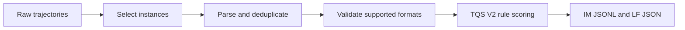

# Conversion Filtering and Scoring

This document describes the filtering and scoring performed by the converters in this repository. It stops at IM and LF output; dataset ranking, diversity sampling, and training-set assembly are not part of the converter workflow.

The broader reference diagram is retained below. Its downstream sampling
stage is not implemented by this repository.

## 1. Instance selection

The Claude Code, OpenCode, OpenHands SDK, and Terminus2 Harbor converters read `result.json` and select instances with `--instance-status`:

- `resolved` selects reward `1.0` and is the default;
- `unresolved` selects reward `0.0`;
- `all` selects every recorded reward group.

These converters then derive the instance ID from each trial's `config.json`.

Repository filtering loads one `owner/repo` entry per line and excludes matching SWE-style instance IDs. Blank lines and comments are ignored. The packaged default list is:

`artifacts/excluded_repos.txt`

Use `--exclude-repos-file <path>` to provide another list or `--exclude-repos-file ""` to disable the filter.

The Claude Code session converter applies the same exclusion mechanism to discovered session paths. Other source-directory converters perform their own source-specific discovery.

## 2. Source-specific extraction

### Claude Code and OpenCode Harbor jobs

For each selected instance, `deduplicate_trajectories()` processes `agent/litellm-trajectory.jsonl` in this order:

1. Drop logger records explicitly marked `success: false`.
2. Sort by `request_time`, treating a missing value as zero.
3. Normalize request input and remove shorter records that are prefixes of later records.
4. Drop records whose input contains at most two entries.
5. Remove exact duplicate records after stripping comparison-only fields such as cache metadata and signatures.

Each remaining logger record is converted independently to IM.

### OpenHands SDK Harbor jobs

The converter reads the last logger record not explicitly marked `success: false`. It skips instances with a missing or empty trajectory, no successful record, an invalid response, or no response choice.

### Terminus2 Harbor jobs

The converter reads `agent/trajectory.json`, iterates the records recognized by the Terminus2 parser, and converts each recognized record. Missing and invalid files are reported and skipped.

### Direct session inputs

The Claude Code session converter discovers either Harbor-style session files or a flat directory of JSONL files, rebuilds messages using the bundled offline prompt and tool definitions, and removes malformed sessions.

The DataClaw converter discovers `conversations.jsonl` files, keeps supported Claude-model records, and converts valid conversations.

## 3. Message validation

The shared validators enforce these message-order rules:

- the first non-system message is `user`;
- the final message is `assistant`;
- `user` is followed by `assistant`;
- `assistant` is followed by `tool` or `user`;
- `tool` is followed by `tool` or `assistant`.

`check_tool_calls()` additionally requires every assistant message except the last assistant message to contain at least one tool call.

Reasoning validation behaves as follows:

- fast trajectories pass without a reasoning-content requirement;
- `strict` mode requires non-empty `reasoning_content` on every checked assistant message;
- `adaptive` mode requires the configured fraction of checked assistant messages to have non-empty `reasoning_content`;
- the default adaptive threshold is `0.2`.

Claude Code and OpenCode Harbor conversion applies role, tool-call, and reasoning checks to every converted record. If any record from an instance fails role/tool-call or reasoning validation, the converter drops all records from that instance.

OpenHands SDK conversion applies the same checks to its single selected record per instance. Claude Code session conversion applies role and reasoning checks to each session. Terminus2 uses its source-specific parser and does not call these shared message validators.

## 4. Rule scoring

Every converter calls `score_dataset()` before writing output:

- main-agent records receive a TQS V2 `_score` object;
- records tagged as subagents are retained with `_score: null`;
- scoring itself does not remove records.

The composite score uses `SUB`, `STP`, `TVR`, `FEC`, and `DPI`; additional metrics are emitted for diagnostics. See [TQS V2 rule scoring](rule_score_details.md).

## 5. Output

`save_jsonl()` writes normalized IM version `2.0.0`, with compatibility and source-specific fields under `meta_info.unique_info`. See the [IM format](im_format.md).

LF output is rendered with the selected tokenizer's chat template. The shared LF writer also emits a `.stats.json` sidecar containing token, turn, score, and tool-call error summaries when those values are available.
